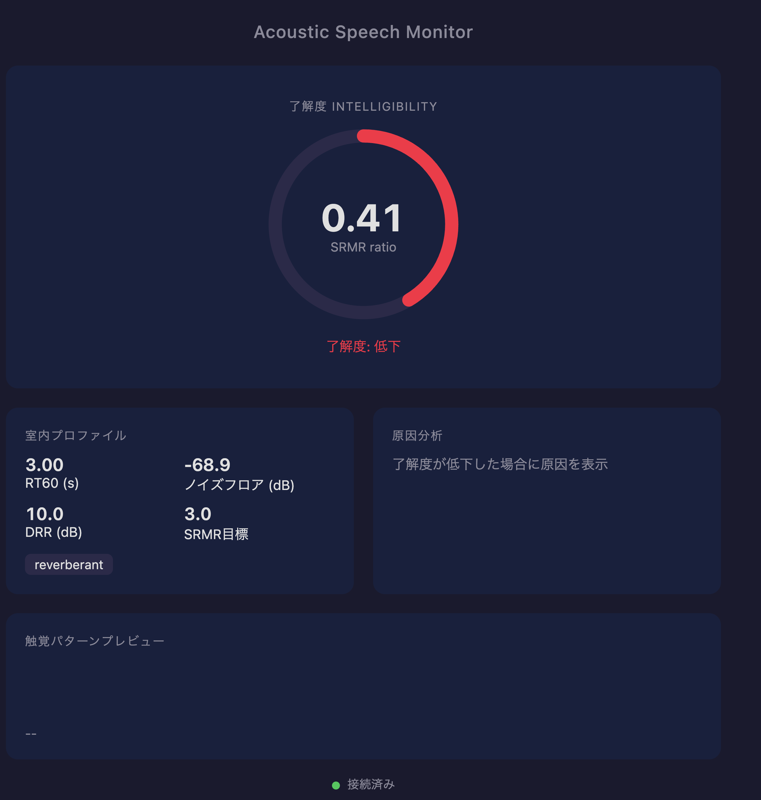

# Acoustic Speech Monitor

難聴者が自分の発話品質をリアルタイムに把握するためのシステム。マイク入力から了解度（SRMR）を計測し、室内音響をプロファイリングし、了解度が低下した場合はその原因を特定してフィードバックを返す。



ダッシュボードは4つの要素で構成される:

- **了解度リング（中央）** — SRMR / 目標値の比率を円弧で表示。1.0以上が緑、0.5〜1.0が黄、0.5未満が赤。SRMRは発話全体を単位とする指標であり、3秒窓かつ「直近の発話継続」ゲート付きで再計算されるため（後述）、連続発話中でも最短1秒間隔でしか更新されない
- **室内プロファイル** — RT60（残響時間、推定信頼度つき）、ノイズフロア、early-to-late ratio（旧DRR相当。オンセット早期/後期のエネルギー比の近似指標で、インパルス応答のDRRとは別物）、推定部屋タイプを表示
- **原因分析** — 了解度が目標を下回った場合、支配的な原因（残響・騒音・調音・距離）と対処法を表示
- **触覚パターンプレビュー** — Pixel Watchに送信される振動パターンを可視化（Phase 1.5で実機連携予定）

## セットアップ

```bash
python -m venv .venv
source .venv/bin/activate
pip install -e ".[dev]"
```

## 起動

```bash
python -m acoustic_mirror
```

ブラウザで http://localhost:8080 を開くとダッシュボードが表示される。

### 2つのモード

| モード | URL | 用途 |
|---|---|---|
| リアルタイムモニター | http://localhost:8080/index.html | 話している最中（通話中など）に状態を継続的に見る |
| マイク診断 | http://localhost:8080/diagnose.html | マイク選び・セッティング調整。数秒録音して一括で詳しく診断する |

マイク診断はブラウザでマイクを選んで録音するので、サーバーを再起動せずにマイクを切り替えて比較できる。録音中はブラウザのエコーキャンセル・ノイズ抑制・自動ゲインを常にオフにする。RT60は録音全体から減衰を複数拾い、その70パーセンタイルを採るので、**文と文の間を1秒ほどあけて話す**と精度が上がる（詳細は `docs/adr/ADR-0004-batch-diagnostic-mode.md`）。

注意: リアルタイムモニターはサーバー側（`--device`）で、マイク診断はブラウザ側で録音する。入力経路が違うため、同じマイクでも両者の数値が完全には一致しないことがある。

### オプション

```
--device ID        入力デバイスID
--sample-rate HZ   サンプルレート（デフォルト: 16000）
--ws-port PORT     WebSocketポート（デフォルト: 8765）
--http-port PORT   HTTPポート（デフォルト: 8080）
--list-devices     利用可能な入力デバイスを表示して終了
```

## テスト

```bash
pytest -v
```

## アーキテクチャ

```
Microphone (16kHz) → [500ms RingBuffer] → SpeechDetector (energy-based VAD)
                                             → RoomProfiler (blind RT60 / noise floor / early-to-late ratio)
                    → [3s RingBuffer, gated] → SRMR (gammatone filterbank → Hilbert envelope → modulation spectrum)
                                                  → CauseSeparator (rule-based diagnosis)
                                                    → WebSocket → Browser Dashboard
```

VAD/RT60推定は応答性が要求されるため500msチャンクのまま。SRMRは元来「数秒の発話単位」の指標なので、専用の3秒バッファを別に持ち、直近の発話継続率が70%以上・前回計算から1秒以上経過というゲートを満たしたときだけ再計算する（詳細は `docs/adr/ADR-0002-decouple-srmr-window-from-feedback-interval.md`）。

### 技術スタック

| レイヤー | 技術 |
|---------|------|
| マイク入力 | sounddevice |
| 信号処理 | NumPy + SciPy |
| WebSocket | websockets (asyncio) |
| ダッシュボード | http.server + vanilla JS |

## ロードマップ

- **Phase 1** (現在): Mac上の音響解析 + ブラウザダッシュボード
- **Phase 1.5**: Android中継アプリ + Pixel Watch触覚フィードバック
- **Phase 2**: LLM-jp-Moshi統合、発話内容の言語的適切さ判定
- **Phase 3**: モバイルアプリ化、Mac依存除去
